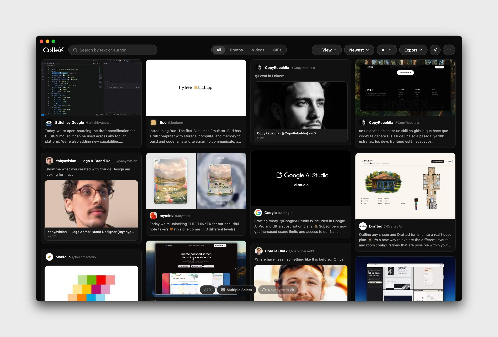

<p align="center">
  
</p>

# ColleX

ColleX is an open-source desktop app for turning your X (Twitter) bookmarks into a clean, visual library you can actually browse and use.

View saved posts in masonry, card, or list layouts. Search, filter by folder or media type, download in bulk, and export to JSON or CSV.

Everything runs locally on your machine. No cloud sync, no telemetry, no data leaving your device.


<p align="center">

</p>

## Features

- Visual bookmark library with masonry, card, and list views
- Support for X bookmark folders, including synced folder structure
- Fast search across post text, author name, and handle
- Filter by folder, media type, and sort order
- Support for photos, videos, GIFs, and text-only posts
- Rich lightbox for viewing media and post details
- Bulk selection and ZIP download for saved media
- Export filtered bookmarks to JSON or CSV
- Local-first experience with no cloud sync or telemetry
- Sign in through X’s official login flow
- Bookmark data stays on your device


## Install

### Option 1 — Download the `.dmg` (recommended)

Grab the latest build from the [GitHub Releases](https://github.com/hasanaydins/ColleX/releases) page.

Pick the build that matches your Mac:

| Mac model | File |
|---|---|
| **Apple Silicon** (M1, M2, M3, M4) | `ColleX-x.y.z-arm64.dmg` |
| **Intel** (pre-2020 Macs) | `ColleX-x.y.z.dmg` |


### Option 2 — Run from source

```bash
git clone https://github.com/hasanaydins/ColleX
cd ColleX
npm install
npm start
```

**Requirements:** Node.js 20+, macOS. (Chrome is only needed if you want the one-click session-import path described below.)


## Storage

Everything lives on disk in your user directory:

```
~/Library/Application Support/ColleX/
├── credentials.json    # auth tokens (local only, never transmitted)
└── bookmarks-data.json # your library (bookmarks + folders)
```

No cloud sync. No analytics. No telemetry. No third-party servers involved.

## Privacy & Security

- **Local-only.** All data and credentials remain on your machine. ColleX does not phone home.
- **No telemetry.** No analytics SDK, no crash reporter, no remote logging.

## Legal

ColleX is an independent, open-source desktop client. It is **not affiliated with, endorsed by, or sponsored by X Corp. or Twitter, Inc.** The names "X" and "Twitter" and related marks are property of their respective owners.

- ColleX runs entirely on the user's own machine using credentials issued to that user by their own X account. It does not use X's developer API, it does not use any API keys, and it does not access anything beyond what the logged-in user can already see at x.com.
- ColleX does not scrape public profiles, does not collect any other user's data, does not automate interactions (no likes, reposts, follows, DMs), and does not redistribute content.
- The software is provided **"AS IS", without warranty of any kind**, express or implied. See [LICENSE](LICENSE) for full terms.

If you are a rights holder and believe the project itself (source code or distributed binaries) infringes your rights, please open an issue or email the maintainer before taking any other action.

## Credits

GraphQL auth-capture approach originally inspired by [@afar1](https://github.com/afar1)'s [fieldtheory-cli](https://github.com/afar1/fieldtheory-cli).

## License

MIT — see [LICENSE](LICENSE).
